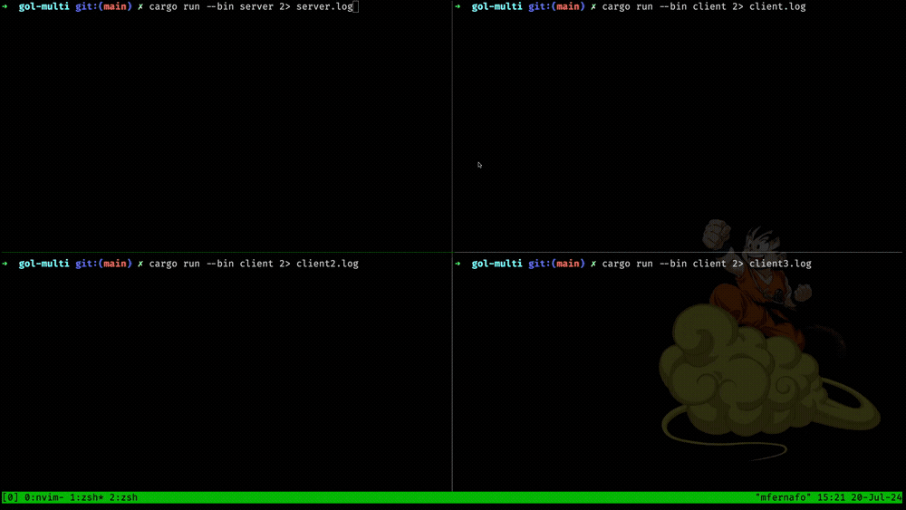

# Online Game of Life

Implementation of [Game of Life](https://en.wikipedia.org/wiki/Conway%27s_Game_of_Life) in Rust. Server sends the grid
to all connected clients each frame.



## Network protocol

Server and client use TcpStreams to communicate. The message format is:

- 1 byte - Command
- 2 bytes - Content size
- 0-65535 bytes - Content

```text
  [command][content_size][content]
```

### Network commands

- 0x00: New grid
- 0x01: Log message
- 0x02-0xFF: Unused

Example new grid message:

```text
  command   | size      | content
  0000 0000 | 1100 0100 | 0000 ... 0000
```

### Grid encoding

Initially, I was sending the grid as a String representation of the cells' state. A single cell was taking one entire
byte over the network ('0' was encoded as 0x30 [Ref](https://en.wikipedia.org/wiki/ASCII#Printable_characters)):

```rust
  //  GRID = ["0", "0", "1", "0", "0", "0", "1", "0", ...] -> 80 elems
  // bytes = [x30, x30, x31, x30, x30, x30, x31, x30, ...] -> 80 bytes
```

This was a waste bc there are only 2 states. Instead I represented each cell as a single bit, which reduced the amount
of data x8 times:

```rust
  //  GRID = ["0", "0", "1", "0", "0", "0", "1", "0", ...] -> 80 elems
  // CGRID = [b00100010, ...] -> 10 bytes
```

## WebSocket implementation

So I went down the rabbit hole of implementing the websocket protocol (partially to support web client). I'm following
the [wikipedia site](https://en.wikipedia.org/wiki/WebSocket).

### TODO

- [X] ~Implement protocol to send/recv data~
- [X] ~Send grid as bit per cell instead of byte per cell~
- [ ] Raw websocket protocol implementation
- [ ] Map clients to protocol for message sending
- [ ] Frontend client implementation
- [ ] Handle client errors
- [ ] Update client pool when client disconnects
- [ ] Improve file logging and create `--debug` flag
- [ ] Allow multiple message sending from server per frame
- [ ] Server to log a QR code for web clients to use (?)
