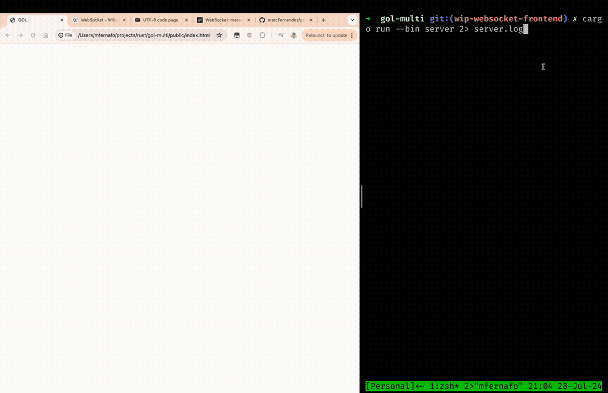

# Online Game of Life

Implementation of [Game of Life](https://en.wikipedia.org/wiki/Conway%27s_Game_of_Life) in Rust. Server sends the grid
to all connected clients each frame.


## Network protocol

Server and client use TcpStreams to communicate. The message format is:

- 1 byte - Command
- 2 bytes - Content size
- 0-65535 bytes - Content

```text
  [command][content_size][content]
```

### Network commands

- 0x00: New grid
- 0x01: Log message
- 0x02: Grid dimensions
- 0x02-0xFF: Unused

Example new grid message:

```text
  command   | size           | content
  0000 0000 | 0x00 1100 0100 | 0000 ... 0000
```

### Grid encoding (first approach)

Initially, I was sending the grid as a String representation of the cells' state. A single cell was taking one entire
byte over the network ('0' was encoded as 0x30 [Ref](https://en.wikipedia.org/wiki/ASCII#Printable_characters)):

```rust
  //  GRID = ["0", "0", "1", "0", "0", "0", "1", "0", ...] -> 80 elems
  // bytes = [x30, x30, x31, x30, x30, x30, x31, x30, ...] -> 80 bytes
```

This was a waste bc there are only 2 states. Instead I represented each cell as a single bit, which reduced the amount
of data x8 times:

```rust
  //  GRID = ["0", "0", "1", "0", "0", "0", "1", "0", ...] -> 80 elems
  // CGRID = [b00100010, ...] -> 10 bytes
```

### Grid encoding (new approach)

After watching ThePrimeagen's video [1000 Players - One Game of Doom](https://www.youtube.com/watch?v=3f9tbqSIm-E), I
thought RLE could be a great fit because:

- Grid is represented as a sequence of bits.
- Most of the consecutive elements have the same value

RLE consists on grouping the consecutive elements with the same value together. For instance, the following 4x4 grid:

```rust
let GRID = ["0", "0", "0", "0",
            "0", "1", "1", "1",
            "0", "0", "0", "0",
            "0", "0", "0", "0"];
```

Would be encoded as:

```rust
let rle_grid = "5z3o8z"; // 5 zeros 3 ones 8 zeros
```

Compared to the binary approach, for this scenario we'd be using 6 bytes instead of 2:

```rust
let raw_grid = GRID; // 16 bytes
let rle_grid = "5z3o8z"; // 6 bytes
let binary_grid = [7, 0]; // 2 bytes
```

Binary encoding takes less space than RLE, but this can be different for larger ones:

```rust
/* GRID size 100x80

   0 0 0 0 0 0 0 ... 0
   .   1             .
   .     1           .
   . 1 1 1           .
   .                 .
   0 0 0 0 0 0 0 ... 0
*/

let binary_grid = [0, 0, 3, ...]; // 1 KB
let rle_grid = "102z1o100z1o97z3o7696z"; // 22 B
```

We have a problem tho, because we cannot differentiate between "number" and "value" bytes. To
address that problem, let's prefix each "number" bytes with a byte denoting the amount of "number"
bytes that follow.

```rust
let rle_grid = [3, "1", "0", "2", "z", ...]; // 22 B + 7 B = 29 B
```

Using RLE, we get rid of the constraint of grid_width*grid_height having to be divisible by 8 (or handle uncompleted
bytes by padding).

#### Some encoding comparison

A glider leads to a encoded 10x8 grid size:

|element|grid dimensions|encoding|avg encoded size (bytes)|
|---|---|---|---|
|stick|48x31|none|1488|
|stick|48x31|binary|186|
|stick|48x31|RLE|14|
|glider|48x10|none|480|
|glider|48x10|binary|60|
|glider|48x10|RLE|24|
|glider|48x31|none|1488|
|glider|48x31|binary|186|
|glider|48x31|RLE|25|
|2xglider|48x31|none|1488|
|2xglider|48x31|binary|186|
|2xglider|48x31|RLE|46|

## WebSocket implementation

So I went down the rabbit hole of implementing the websocket protocol (partially to support web client). I'm following
the [wikipedia site](https://en.wikipedia.org/wiki/WebSocket).

**Update**: Server is able to speak websocket language now. Frontend is able to parse dimensions and new_grid commands
and draw the board on HTMLCanvas.



### Client setup

1. Compile `main.ts`:

```bash
npx tsc main.ts
```

2. Start the server:

```bash
cargo run --bin server 2> server.log
```

3. Open frontend in browser: `file://<path_to_repo>/public/index.html`

### TODO

> Those are in order of priority, but it can always change ¯\\_(ツ)_/¯

- [X] ~Implement protocol to send/recv data~
- [X] ~Send grid as bit per cell instead of byte per cell~
- [X] ~Update client pool when client disconnects~
- [X] ~Map clients to protocol for message sending~
- [X] ~Frontend client implementation~
- [X] ~Raw websocket protocol implementation~
  - [X] ~Basic implementation for small messages~
  - [ ] Write and read messages larger than 2^23 bytes
- [X] ~RLE encoding~
- [ ] Explore sending only updated cells
- [ ] Proper metrics and fancy graphs
- [ ] Send relevant info to clients (i.e: active connections)
- [ ] Gracefully handle client errors
- [ ] Server to log a QR code for web clients to use (inspired by **tj_deev** [Writing a QR Code Generator in Go](https://www.youtube.com/watch?v=71SO8NB2ghU))
- [ ] Send colors (?)
- [ ] Improve file logging and create `--debug` flag
